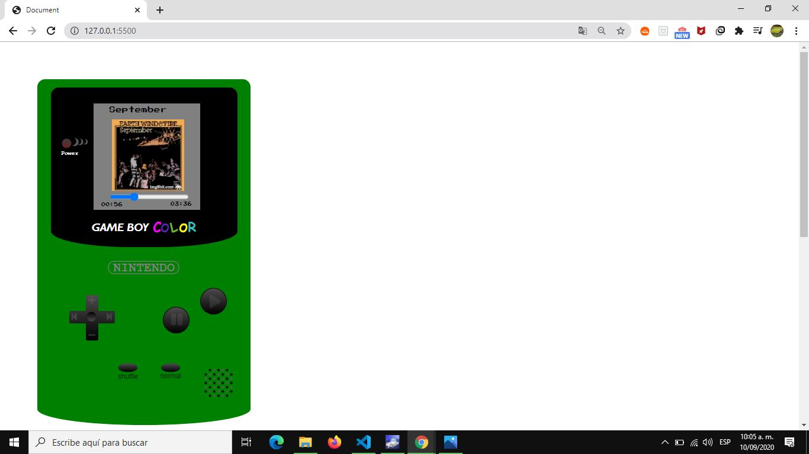

Los Botones de la derecha se gutilizan para darle play y pausa a la cancion.
Los Botones en la parte inferior cambian el orden de las canciones, el boton de la izquierda lo pone aleatorio y el de la derecha pone el orden normal creado de fabrica.
La cruz ubicada en la parte izquierd, permite cambiar cancion (hacia la derecha) retroceder a la cancion anterior (hacia la izquierda), subir volumen(hacia arriba), y bajar volumen (hacia abajo).

